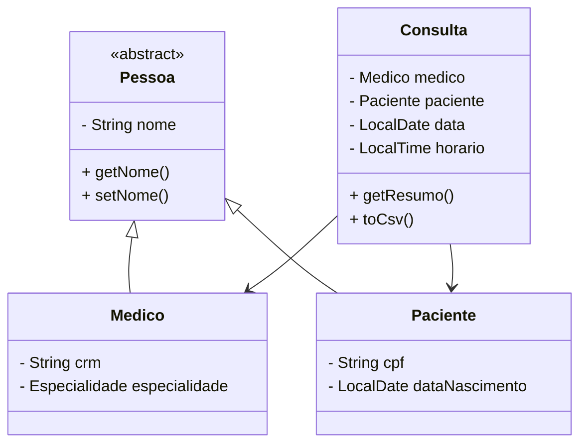

### 1 . Contexto & Objetivo do Projeto

* **RA1 → RA3**

  * RA1: leitura de CSV, filtro simples em console.
  * RA3: **interface Swing**, persistência binária, CSV de exportação, exceções próprias.
* **Meta da ficha de avaliação**

  * Demonstrar **POO avançada** (herança, polimorfismo, interfaces).
  * Provar domínio de **I/O** (CSV ↔ binário).
  * Exibir **GUI funcional** com filtros de busca e geração de relatórios.

> **Resumo-relâmpago**: simular um pequeno sistema ambulatorial que lê listas de médicos, pacientes e consultas, permite buscas refinadas e exporta resultados.

---

### 2 . Fundamentos Java / POO Essenciais

| Conceito           | “Em 1 frase”                              | Código-flash                                              |
| ------------------ | ----------------------------------------- | --------------------------------------------------------- |
| **Classe**         | Molde de objetos                          | `class Medico { ... }`                                    |
| **Objeto**         | Instância viva da classe                  | `Medico m = new Medico();`                                |
| **Encapsulamento** | Campos privados + getters/setters         | `private String crm;`                                     |
| **Herança**        | Classe herda atributos/métodos            | `class Medico extends Pessoa`                             |
| **Abstração**      | Classe-gabarito, não instanciável         | `abstract class Pessoa`                                   |
| **Polimorfismo**   | Mesma chamada → comportamentos diferentes | `List<Pessoa> pessoas` pode conter médicos *ou* pacientes |
| **Interface**      | Contrato sem implementação                | `interface Exportavel { String toCsv(); }`                |

> Para quem chega do **zero**, compare : *classe* = receita de bolo, *objeto* = bolo pronto; *interface* = lista de requisitos da receita.

---

### 3 . Estrutura de Pastas e Pacotes

```
TrabalhoRA3/
 ├── README.md
 ├── application.properties
 └── src/
     ├── model/         ← domínio (Pessoas, Consultas)
     ├── exceptions/    ← erros customizados
     ├── persistence/   ← I/O CSV & binário
     ├── utils/         ← utilidades genéricas (CsvWriter)
     ├── controller/    ← regras de negócio (ConsultaController)
     └── view/          ← GUI Swing (MainApp)
```

* **Pacote = pasta**: ajuda a evitar colisão de nomes e melhora legibilidade.
* **Convite didático**: percorra `src/` top-down na IDE para ver dependências.

---

### 4 . Modelo de Domínio (Camada *model*)



* **`Pessoa` (abstract)**: garante que *todo* médico e paciente tenha `nome`.
* **`Medico`**: adiciona `crm` + enum `Especialidade`.
* **`Paciente`**: adiciona `cpf` + `dataNascimento`.
* **`Consulta`**: liga as duas pontas e implementa `Exportavel` → gera linha CSV.

---

### 5 . Persistência de Dados

1. **Leitura CSV inicial**

   ```java
   List<Consulta> consultas = arquivoService.readCsv("consultas.csv");
   ```

   * Lança `ArquivoInvalidoException` se formato estiver errado.
2. **Gravação binária**

   ```java
   arquivoService.writeBinary(consultas, "consultas.bin");
   ```

   * Serializa objetos → arranque rápido nas próximas execuções.
3. **Leitura binária** (na partida do app)

   * Muito mais veloz que parsear CSV novamente.
4. **Exportação final**

   ```java
   CsvWriter.export(resultado, "minhas-consultas.csv");
   ```

   * Usa `Exportavel.toCsv()` + delimitador definido em `application.properties`.

---

### 6 . Tratamento de Datas & Horários

* **Por que `java.time.*` (Java 8+)**

  * Imutável, seguro, legível (`LocalDate`, `LocalTime`, `DateTimeFormatter`).
* **Ordenação natural**

  ```java
  lista.sort(
      Comparator.comparing(Consulta::getData).thenComparing(Consulta::getHorario)
  );
  ```
* **Filtros de intervalo** no método `buscar()`:

  * `dataInicial`, `dataFinal` (pode ser `null` ⇒ ignora filtro).
  * `mesesSemConsulta` avalia diferença entre hoje e última consulta do paciente.

---

### 7 . Camada de Controle

```java
public class ConsultaController {
    private final List<Consulta> cache = new ArrayList<>();

    public void loadData(String binPath) throws PersistenciaException { ... }

    public List<Consulta> buscar(String crm, String cpf,
                                 LocalDate di, LocalDate df,
                                 Integer mesesSemConsulta)
                                 throws BuscaInvalidaException { ... }

    public void exportarCsv(List<Consulta> res, String out)
                                 throws IOException { ... }

    public void consolidarRelatorio(List<List<Consulta>> partes, String out)
                                 throws IOException { ... }
}
```

* **Responsa-chave**: isolar regras de negócio da GUI.
* **Validação forte**: se parâmetros vazios/inválidos → `BuscaInvalidaException`.

---

### 8 . Exceções Personalizadas

| Classe                     | Quando é lançada                                             | Por quê?                             |
| -------------------------- | ------------------------------------------------------------ | ------------------------------------ |
| `ArquivoInvalidoException` | CSV mal-formatado, campo faltando                            | Feedback claro para dados de entrada |
| `PersistenciaException`    | Falha de I/O binário (leitura ou gravação)                   | Separa problemas de disco/perm       |
| `BuscaInvalidaException`   | Parâmetros inconsistentes (ex.: `dataInicial` > `dataFinal`) | Evita resultados sem sentido         |

> **Pergunta clássica**: “Por que não usar `IOException` direto?”
> **Resposta**: queremos mensagens específicas e tratamento distinto em camadas superiores.

---

### 9 . Interface Gráfica Swing (*view\.MainApp*)

```
JFrame
 └── JTabbedPane
      ├─ aba "Busca Médico"
      │    ├─ JTextField (CRM)
      │    ├─ Data pickers (inicial/final)
      │    ├─ JButton "Buscar"
      │    ├─ JTable resultados
      │    └─ JButton "Exportar CSV"
      └─ aba "Busca Paciente"
           (CPF + filtros iguais)
+ Botão global "Gerar Relatório Final"
```

* **Ciclo de eventos**

  1. Ao abrir: `controller.loadData("consultas.bin")` → `JTable` já preenchida.
  2. Usuário ajusta filtros, clica **Buscar** → chama `controller.buscar()`.
  3. **Exportar CSV** salva resultado onde o usuário escolher (`JFileChooser`).
  4. **Gerar Relatório Final** consolida vários resultados parciais em único arquivo.

---

### 10 . Ciclo Completo de Execução

1. **Primeira vez**

   * Lê 3 CSV originais → monta objetos → salva `consultas.bin`.
2. **Partidas seguintes**

   * Lê direto o binário (startup mais rápido).
3. **Durante o uso**

   * Filtros em memória (não relê arquivos).
4. **Saída**

   * Exportações CSV sob demanda + um “relatório final” se pedido.

---

### 11 . Arquivos de Configuração & Exemplos CSV

**`application.properties`**

```
medicos.csv=data/medicos.csv
pacientes.csv=data/pacientes.csv
consultas.csv=data/consultas.csv
csv.delimitador=;
formato.data=yyyy-MM-dd
formato.hora=HH:mm
```

* Mudar delimitador? Só alterar aqui.

**Estrutura mínima de `consultas.csv`**

```
crm;cpf;data;hora
1234;111.222.333-44;2024-10-10;09:30
...
```

---

### 12 . Como Compilar, Rodar e Testar (sem Maven)

```bash
# 1. Compilar
javac -d bin $(find src -name "*.java")

# 2. Executar
java -cp bin view.MainApp
```

> **Erros comuns**
>
> * “`application.properties (No such file or directory)`”
>   ➜ Rode a partir da raiz do projeto **ou** adicione `resources` ao classpath.
> * Falta de encoding UTF-8 nos CSV → garanta `;` e sem BOM.

---

### 13 . Perguntas Frequentes & Dicas de Defesa

| Pergunta do professor                                   | Resposta curta & certeira                                                            |
| ------------------------------------------------------- | ------------------------------------------------------------------------------------ |
| **Por que usar `writeBinary` se já tenho o CSV?**       | Velocidade de carga (OOP serializado) e demonstração de uso de `ObjectOutputStream`. |
| **Onde as listas vivem depois que leio o arquivo?**     | Em memória, dentro do `ConsultaController` (atributo `cache`).                       |
| **Por que `throws` sem `try-catch` em alguns métodos?** | Para propagar à camada que *sabe* lidar (ex.: GUI mostra `JOptionPane`).             |
| **Como garantir unicidade de CRM/CPF?**                 | Sobrescrevemos `equals()`/`hashCode()` em `Medico` e `Paciente`.                     |
| **Diferença entre interface e classe abstrata aqui?**   | `Pessoa` fornece *estado comum*; `Exportavel` apenas um *contrato* sem estado.       |

---

## Conclusão

Com este roteiro, seus colegas conseguem:

1. Entender os **conceitos de POO** usados.
2. Percorrer a **estrutura de pacotes** sem se perder.
3. Explicar o **fluxo de dados** (CSV → binário → GUI → exportação).
4. Responder às **principais perguntas** do professor com segurança. 
